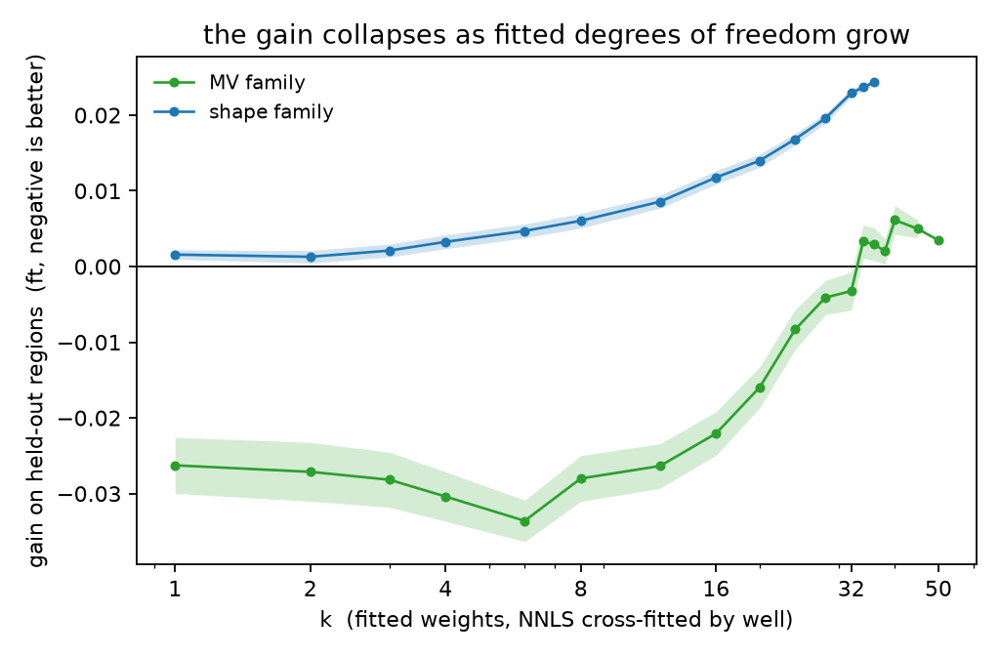

# Fitted degrees of freedom, not in-sample tuning, is what fails to transfer

Code, figures and intermediate tables for the manuscript in [`PAPER.md`](PAPER.md).

A simple average of forecasts often beats a combination whose weights are estimated from data — the
*forecast combination puzzle*, known since Bates and Granger (1969). This work turns that binary
comparison into a curve: holding the candidate pool, the aggregation rule and the tuning location
fixed, and varying only the number of fitted weights *k*, the held-out gain degrades monotonically
and crosses from helping to hurting at a measurable point.

## The result in one figure



Two candidate families that share no mechanism, 100 random draws per *k*, non-negative least squares
fitted out-of-fold by unit, read on eight spatially disjoint held-out blocks. The curves are
parallel: they differ in intercept, not in slope. One family crosses zero at *k* ≈ 33; the other is
already unprofitable at *k* = 1.

The sharpest form of the result uses the same 37 candidates two ways:

| combination rule | fitted weights | held-out gain |
|---|---|---|
| averaged, carried at one weight | 1 | **−0.033** |
| non-negative least squares | 37 | **+0.024** |

Same candidates, same rows, same blocks. The 0.058 between them is the combination rule alone.

## What runs standalone

| script | needs | what it produces |
|---|---|---|
| [`code/synthetic_dof.py`](code/synthetic_dof.py) | **nothing but numpy/scipy** | the controlled study: *k\** grows with *n*, `figures/synthetic.png` |

`synthetic_dof.py` is the part anyone can check. It generates its own data, reproduces the crossing,
and shows it moving linearly with the number of units. Run it:

```bash
python -m code.synthetic_dof     # or: python code/synthetic_dof.py
```

It also records a result that took a wrong turn to find: with *exchangeable* candidates there is no
crossing at all, because the equal-weight mean is already optimal and fitting can only add variance.
Heterogeneous candidate quality is what creates something for fitting to find.

## What needs the wellbore frame

The remaining scripts read a 465-unit prediction frame built from a public modelling competition's
training data. **That data is not redistributed here** — it is subject to the competition's terms.
The intermediate tables every figure is drawn from *are* included, in [`figures/`](figures), so the
numbers in the manuscript can be checked without the raw data:

| table | figure or table in the paper |
|---|---|
| `figures/claim1.csv`, `claim1_price.csv` | Table 1 — in-sample vs held-out vs *k*-weight mixture |
| `figures/dofcurve2.csv` | Figure 3 — the *k* curve, two families, 100 draws each |
| `figures/frontier.csv` | Figure 4 — 671 members on one accuracy/decorrelation frontier |
| `figures/motivation.csv` | Figure 1 — error concentration and the per-well oracle line |
| `figures/countcurve.csv` | member-count saturation, three families |
| `figures/synthetic.csv` | the controlled study |

With the frame present, `code/reproduce.py` rebuilds every figure and diffs a digest of each table,
so an input that moved under the paper shows up as a diff rather than as a quietly different figure.

## Layout

```
PAPER.md              the manuscript
SUBMISSION_IJF.md     front matter, highlights, CRediT, cover letter
figures/              four paper figures, two supporting, and every table behind them
code/                 analysis scripts
```

## Citation

Han, J. *Fitted degrees of freedom, not in-sample tuning, is what fails to transfer: a measured
combination curve from 465 wells.* Manuscript, 2026.

## License

Code is MIT (see [`LICENSE`](LICENSE)). The manuscript text and figures are CC BY 4.0.
